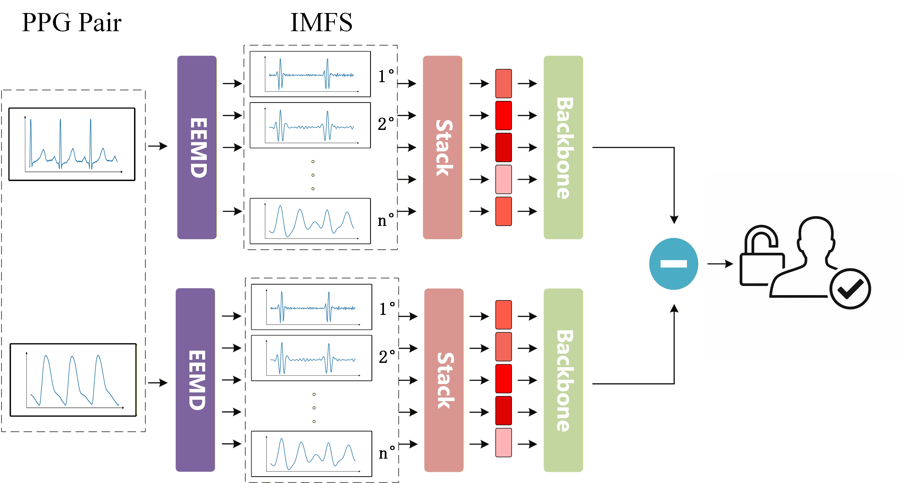

# Ring-ID: Lightweight and Open-Set PPG Authentication for Smart Rings


---

## 📌 Project Overview

This project implements a **PPG-based identity authentication system using a Siamese neural network**.

By leveraging Photoplethysmography (PPG) signals from wearable devices, the system enables **non-contact physiological biometric authentication**.

### ✨ Key Features

* 🔗 **Siamese Neural Network** for feature extraction and similarity learning
* 🧠 **Open-set (zero-shot) authentication**, supporting unseen users
* ⚡ **Lightweight model**

  * Parameters: **0.0139M**
  * CPU latency: **103.4 ms**
* 📱 Suitable for **resource-constrained wearable devices**

<p align="center">
  
</p>

---

## 🧪 Environment Setup

Recommended environment:

* Python ≥ 3.8
* PyTorch = 2.5.1 + cu124

### Install Dependencies

```bash
conda env create -f environment.yml
# or install manually
```

---

## 📂 Dataset

Download datasets from:

* [BIDMC Dataset](https://physionet.org/content/bidmc/1.0.0/)
* [CapnoBase Dataset](https://borealisdata.ca/dataset.xhtml?persistentId=doi:10.5683/SP2/NLB8IT)

---

## ⚙️ Configuration

All parameters are defined in:

```bash
config.yaml
```

---

## 📁 Dataset Structure

```text
dataset_path/
├── character01/
│   ├── 01.npy
│   ├── 02.npy
│   └── ...
├── character02/
├── character03/
└── ...
```

Example dataset:

```bash
datasets/hilbert/bidmc/train
```

---

## 🔄 Preprocessing & Model Selection

| Method     | Input Shape         | Backbone Options                                      | flat_shape |
| ---------- | ------------------- | ----------------------------------------------------- | ---------- |
| EEMD       | (6, segment_length) | Conv1D / GRU / LSTM / TCN                             | 64         |
| Hilbert    | (3, segment_length) | Conv1Dhilbert / GRUhilbert / LSTMhilbert / TCNhilbert | 64         |
| Raw Signal | (1, segment_length) | Conv1Dseq / GRUseq / LSTMseq / TCNseq                 | 32         |

### Notes

* `segment_length` default = **256** (adjust based on sampling rate)
* Other hyperparameters (learning rate, batch size, epochs) are configurable in `config.yaml`

---

## 🚀 Training

### Step 1: Prepare Data

Place dataset under `dataset_path` or modify path in `config.yaml`.

If using Hilbert preprocessing:

```bash
python hilbert.py
```

---

### Step 2: Configure Model

Edit `config.yaml`:

* preprocess
* backbone
* training parameters

---

### Step 3: Start Training

```bash
python train.py
```

---

## 📊 Evaluation

After training, evaluate the model using the test dataset.

### Modify parameters in evaluation script:

```python
data_dir = "datasets/hilbert/bidmc/test"
model_path = "path/to/your/model.pth"
output_dir = "evaluation/results"

model_name = "GRUhilbert"
flat_shape = 64
```

### Supported Metrics

* Accuracy
* Precision / Recall / F1-score
* FAR / FRR
* EER
* AUC
* TAR @ FAR = 1%

### Visualization

* ROC Curve
* DET Curve

---

## 📚 Reference

The Siamese network implementation is based on:

https://github.com/bubbliiiing/Siamese-pytorch.git

---

## 📄 License

This project is released under the MIT License.
